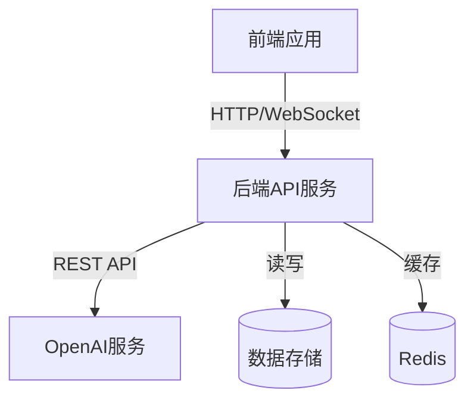
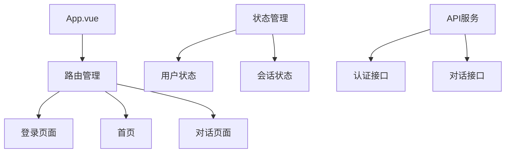
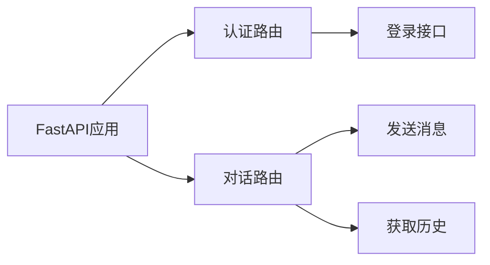
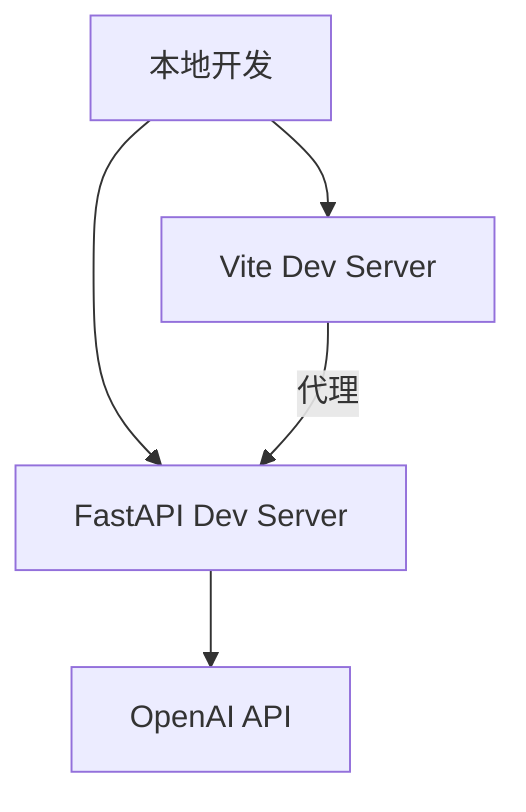
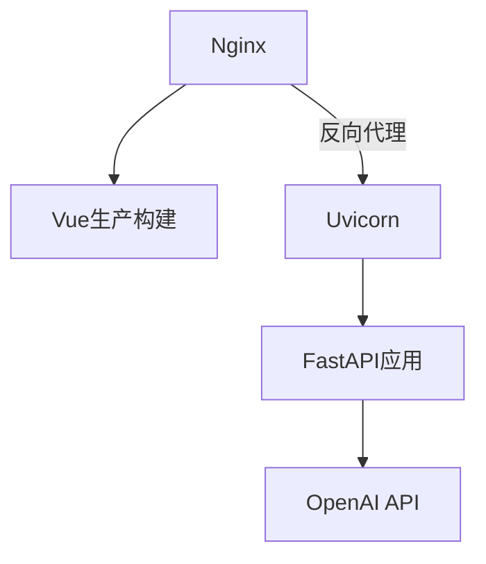

# 知答技术设计文档 v1.0

## 1. 系统架构

### 1.1 总体架构
系统采用前后端分离架构：
- 前端：Vue 3 + TypeScript单页面应用
- 后端：Python FastAPI RESTful服务
- AI服务：OpenAI GPT API集成



### 1.2 技术栈选型

#### 前端技术栈
- 核心框架：Vue 3 + TypeScript
- 构建工具：Vite 4.x
- UI组件：Element Plus
- 状态管理：Pinia
- 路由：Vue Router 4
- HTTP客户端：Axios
- 工具库：
  - dayjs（时间处理）
  - marked（Markdown渲染）
  - DOMPurify（XSS防护）

#### 后端技术栈
- Web框架：FastAPI
- ASGI服务器：Uvicorn
- 认证：
  - JWT（JSON Web Tokens）
  - passlib（密码加密）
- AI集成：OpenAI API
- 环境配置：python-dotenv

## 2. 核心模块设计

### 2.1 前端模块设计


#### 2.1.1 页面组件
- App.vue: 应用根组件
  - 全局导航栏
  - 路由视图
  - 用户状态管理
- LoginView: 登录页面
  - 表单验证
  - JWT认证
  - 错误处理
- HomeView: 首页仪表盘
  - 数据统计展示
  - 功能导航
- ChatView: 对话界面
  - 会话管理
  - 消息列表
  - 实时对话

#### 2.1.2 核心功能实现
- 路由管理
  - 基于Vue Router的SPA路由
  - 路由守卫实现认证控制
  - 动态路由加载
- 状态管理
  - 用户认证状态
  - 会话数据缓存
  - 全局配置管理
- API集成
  - 统一的API请求封装
  - 请求拦截器（Token注入）
  - 响应拦截器（错误处理）

### 2.2 后端模块设计

#### 2.2.1 API路由设计


- 认证模块 (/api/v1)
  - POST /login：用户登录
  - GET /logout：用户登出
- 对话模块 (/api/v1)
  - POST /chat：发送消息
  - GET /chat/history：获取历史记录

#### 2.2.2 数据模型
```python
# 用户模型
class User(BaseModel):
    username: str
    disabled: Optional[bool] = None

# 消息模型
class Message(BaseModel):
    role: str
    content: str
    timestamp: Optional[datetime] = None

# 对话请求
class ChatRequest(BaseModel):
    message: str

# 对话响应
class ChatResponse(BaseModel):
    response: str
    messages: List[Message]
```

### 2.3 安全设计

#### 2.3.1 认证机制
- JWT Token认证
  - Token生成和验证
  - 过期时间控制
  - 刷新机制

#### 2.3.2 数据安全
- 传输安全
  - HTTPS加密传输
  - WebSocket安全连接
- 应用安全
  - XSS防护
  - CSRF防护
  - 输入验证

### 2.4 部署架构

#### 2.4.1 开发环境


#### 2.4.2 生产环境


## 3. 接口文档

### 3.1 认证接口
```typescript
// 登录
POST /api/v1/login
Request:
{
    username: string
    password: string
}
Response:
{
    access_token: string
    token_type: string
}
```

### 3.2 对话接口
```typescript
// 发送消息
POST /api/v1/chat
Request:
{
    message: string
}
Response:
{
    response: string
    messages: Array<{
        role: string
        content: string
        timestamp: string
    }>
}

// 获取历史记录
GET /api/v1/chat/history
Response:
Array<{
    role: string
    content: string
    timestamp: string
}>
```

## 4. 后续优化计划

### 4.1 功能优化
- 实现用户注册功能
- 添加消息撤回功能
- 支持图片消息
- 添加用户偏好设置

### 4.2 性能优化
- 实现消息分页加载
- 添加请求缓存层
- 优化大量消息的渲染性能
- 实现消息预加载

### 4.3 部署优化
- 添加Docker支持
- 实现自动化部署
- 添加性能监控
- 优化错误处理机制