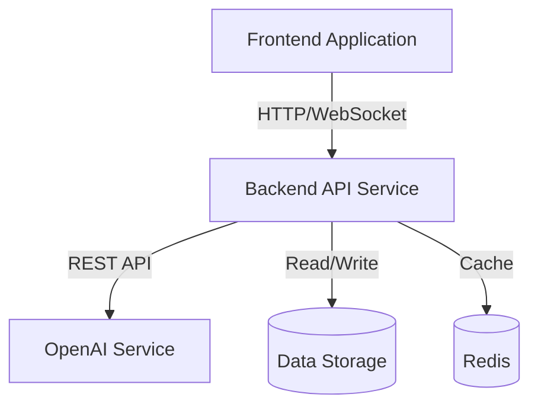
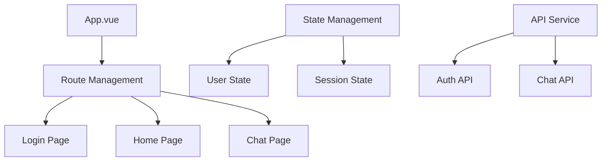
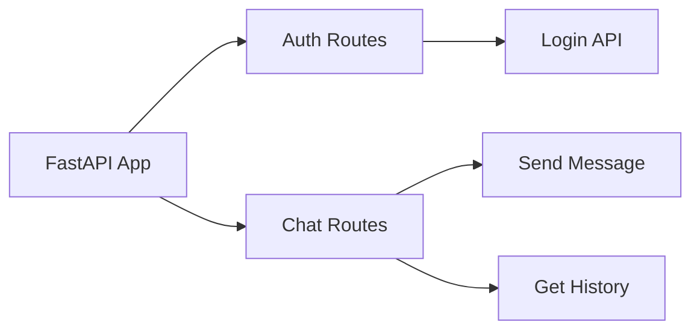
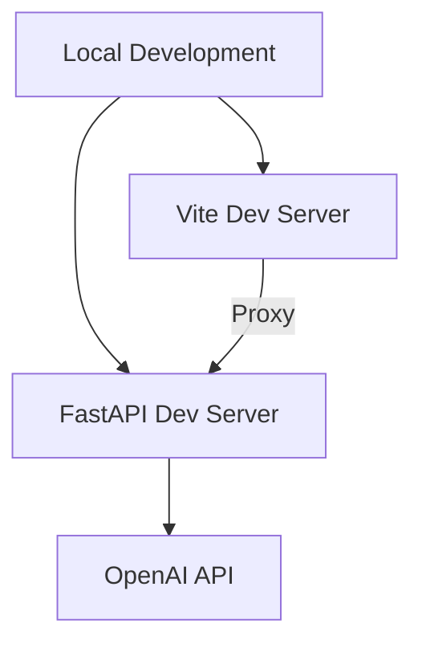
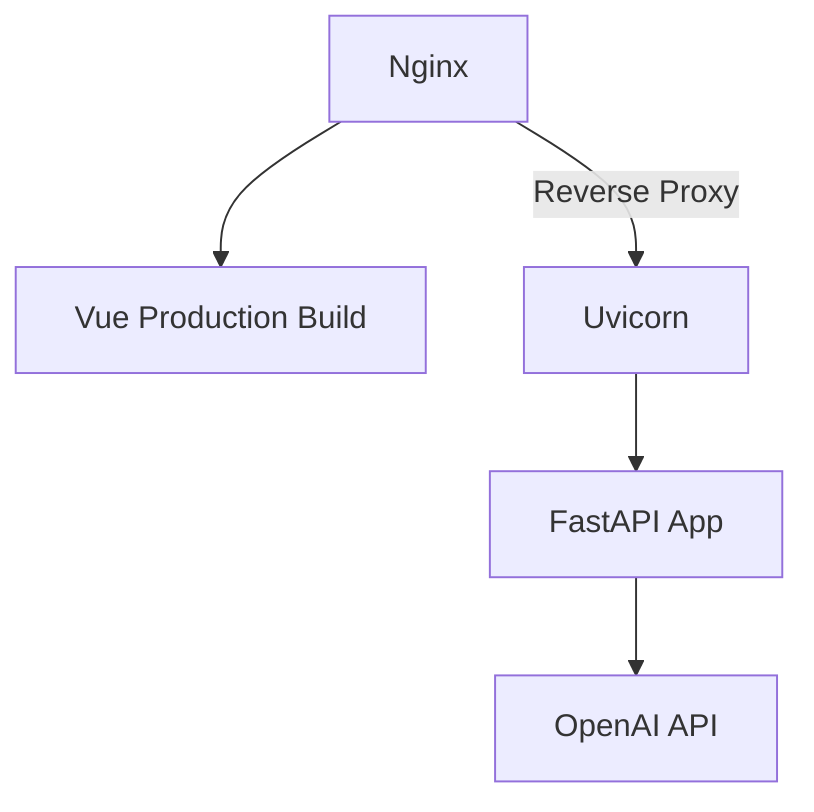

# Technical Design Document v1.0

## 1. System Architecture

### 1.1 Overall Architecture
The system adopts a front-end and back-end separated architecture:
- Frontend: Vue 3 + TypeScript single-page application
- Backend: Python FastAPI RESTful service
- AI Service: OpenAI GPT API integration



### 1.2 Technology Stack Selection

#### Frontend Stack
- Core Framework: Vue 3 + TypeScript
- Build Tool: Vite 4.x
- UI Components: Element Plus
- State Management: Pinia
- Router: Vue Router 4
- HTTP Client: Axios
- Utility Libraries:
  - dayjs (time handling)
  - marked (Markdown rendering)
  - DOMPurify (XSS protection)

#### Backend Stack
- Web Framework: FastAPI
- ASGI Server: Uvicorn
- Authentication:
  - JWT (JSON Web Tokens)
  - passlib (password encryption)
- AI Integration: OpenAI API
- Environment Config: python-dotenv
- Database: MySQL + SQLAlchemy
- Cache: Redis

## 2. Core Module Design

### 2.1 Frontend Module Design


#### 2.1.1 Page Components
- App.vue: Root component
  - Global navigation bar
  - Router view
  - User state management
- LoginView: Login page
  - Form validation
  - JWT authentication
  - Error handling
- HomeView: Dashboard page
  - Statistics display
  - Feature navigation
- ChatView: Chat interface
  - Session management
  - Message list
  - Real-time chat

#### 2.1.2 Core Features
- Route Management
  - Vue Router based SPA routing
  - Route guards for authentication
  - Dynamic route loading
- State Management
  - User authentication state
  - Session data cache
  - Global configuration
- API Integration
  - Unified API request wrapper
  - Request interceptor (Token injection)
  - Response interceptor (Error handling)

### 2.2 Backend Module Design

#### 2.2.1 API Route Design


- Auth Module (/api/v1)
  - POST /login: User login
  - GET /logout: User logout
- Chat Module (/api/v1)
  - POST /chat: Send message
  - GET /chat/history: Get history

#### 2.2.2 Data Models
```python
# User Model
class User(BaseModel):
    username: str
    disabled: Optional[bool] = None

# Message Model
class Message(BaseModel):
    role: str
    content: str
    timestamp: Optional[datetime] = None

# Chat Request
class ChatRequest(BaseModel):
    message: str

# Chat Response
class ChatResponse(BaseModel):
    response: str
    messages: List[Message]
```

### 2.3 Security Design

#### 2.3.1 Authentication Mechanism
- JWT Token Authentication
  - Token generation and validation
  - Expiration time control
  - Refresh mechanism

#### 2.3.2 Data Security
- Transport Security
  - HTTPS encryption
  - WebSocket secure connection
- Application Security
  - XSS protection
  - CSRF protection
  - Input validation

### 2.4 Deployment Architecture

#### 2.4.1 Development Environment


#### 2.4.2 Production Environment


## 3. API Documentation

### 3.1 Authentication API
```typescript
// Login
POST /api/v1/login
Request:
{
    username: string
    password: string
}
Response:
{
    access_token: string
    token_type: string
}
```

### 3.2 Chat API
```typescript
// Send Message
POST /api/v1/chat
Request:
{
    message: string
}
Response:
{
    response: string
    messages: Array<{
        role: string
        content: string
        timestamp: string
    }>
}

// Get History
GET /api/v1/chat/history
Response:
Array<{
    role: string
    content: string
    timestamp: string
}>
```

## 4. Future Optimization Plans

### 4.1 Feature Optimization
- Implement user registration
- Add message recall functionality
- Support image messages
- Add user preferences settings

### 4.2 Performance Optimization
- Implement message pagination
- Add request caching layer
- Optimize large message rendering
- Implement message preloading

### 4.3 Deployment Optimization
- Add Docker support
- Implement automated deployment
- Add performance monitoring
- Optimize error handling mechanism